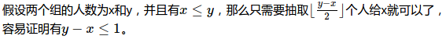
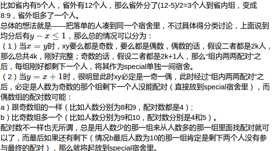

# 宿舍成员分配算法
### 算法的输入
性别相同的两组学生，按地域划分为省内组和省外组，每个人由一组已知的信息表示，比如学号、性别、起居时间段、兴趣爱好等等。

### 对于每个宿舍成员划分，主要要求
1. 尽量均匀来自两个组，比如保证省内2名、省外2名，最好不要出现全都是省内/外的情况；
2. 性格动静结合，但尽量不要出现3个安静1个活跃型这种情况；
3. 家庭人均收入尽量不要悬殊，比如一个500以下，三个3000以上；
4. 其它条件尽量相似。

### 思路分析
这个问题如果暴力实现的话，需要枚举的情况数为：
<!-- $$ C_4^4*C_8^4*\ldots*C_n^4 $$ -->

也就是说，这是一个组合爆炸问题，求最优解是很耗时的一件事（n较大的时候基本是不可能做到的），所以我转而求近似解，通过贪心法来组合配对。

### 算法流程
1. 均分两个组的人数，抽取人数较多的一组的部分人到另外一组，使得两组的人数相差不超过1；
2. 组内两两配对，根据相似度来配对，两人的特征值平均得到一个新的特征来代表这两个人的组合；
3. 将两个人组合后的特征在两个组之间配对，即1个GroupA的组合加1个GroupB的组合为一个宿舍，也是根据相似度最相近来组合。

### 细节
1. **从人数较多的组抽取多少人到另外一个组呢？**

2. **从人数较多的组抽取哪些人放到另外一组呢？**
我的想法是，这些人要尽量不相同，因为抽取后它们就成为同一组的人了，如果是他们比较相似的话，很容易在“组内两两配对”阶段就组合到了一起。
比如一般省外的同学比较多，那么组合后就变成了两个省外的同学，如果这样的话，那么在“组与组之间配对”的时候，很容易形成4个都是省外的同学的宿舍，不满足第一条约束。
所以说，抽取出来的人要尽量不同。那怎么做到这一点呢？我就使用了kmeans，比如要抽取K个人，那么就人数较多的一组聚类分成K类，每类里面抽取那个离类中心最近的点（离簇中心最近，最能够表示那一类的特点，反过来也是与其它簇最不相同的点）。
从另外的角度来看，不同的簇代表不同个性、志趣的人群，为了更多元化地进行group combination，这样子抽取也是比较合理的。

3. **kmeans会形成空簇，怎么解决这个问题？**
这个问题有很多解决方法，我选取了容易实现的方法：增量更新簇的中心。
因为当一个簇减少为只有一个点的时候，那么这个点就是这个簇的中心，保证了每个簇至少有一个点，绝对不可能形成空簇！

4. **人数参差不齐的时候怎么办？**，

5. **将落单的人分配到同一个宿舍真的好吗？**
我觉得是没什么大的问题的，可以从“他们为什么会落单”的原因来看，配对的时候用的是”贪心法“，总是找当前群体里最相似的个体来配对。之所以落单，主要是因为他们在群体中与其他人不是特别相似，要么就是比较平均的特征，要么就是比较极端的特征，那么将他们分配到同一个宿舍的话，相似的可能性也比较大，再说了，还有最后的人工检查分配结果的阶段，如果发现确实不合适，可以略做调整或重新分过。

6. 数据的处理
这个算法主要是通过计算距离来分配的，所以距离的计算是最关键的，这个用到了在数据挖掘课程中学过的一些处理数据的技巧。
比如在起床时间这个维度，有4个时间段，但是这四个时间段不应该是均匀的，比如10:30-11:00，与11:00-12:00比较接近，但是它和1:00-2:00的距离就不是与11:00-12:00的简单三倍了，而应该是更大的倍数，这样才能从距离上把两者尽可能地分开！！我做了平方，比如原来是1,2,3,4，现在就会变成1,4,9,15，同理对于家庭收入也是如此处理。
反过来，对于喜欢开空调与否，程序从否，不清楚，到是，这个值分别为0,1,2，应该是没问题的，因为在实际意义上其实跟上面的情况不一样，不需要特别把喜欢开空调与其它两者区分得特别开。

### 分配结果
目前的数据是我自己随便造的，没有真实的数据来测试，目前的分类结果如下（由于kmeans的初始化是随机选择中心点的，所以每次运行得到的结果不一定一样）：

比如上图选中的列划分还算不错，不过其它列可能是因为比重比较小以及这个算法还有较大的改善的空间等原因，划分得不够好。

### 后续工作
其实我一直在考虑如何衡量分配结果的好坏，因为要求是多个维度上的相似，且各个维度对总体的比重大相径庭，用肉眼来看的话，分在同一宿舍里的人，有的维度上挺好的，但有的维度上又不太好，目前有一个想法就是用kmeans的SSE定义，就是同一宿舍内距离起“中心点“的距离的平方和，将所有宿舍的SSE加起来就的到了总体的误差是怎样的。

但是关键是，有了衡量标准，**怎么根据这个标准使得算法自动去做得更好呢**？有待后续完善。

目前还存在的问题就是，由于用的是最简单的kmeans，它聚类的结果**严重受限于初始化**，而初始化又是**随机的**，所以划分的结果**比较不稳定**（也可能是当前的测试数据量太少了，只有12个），这也是后续改善算法的一个方向——如何较好地初始化kmeans的簇中心。